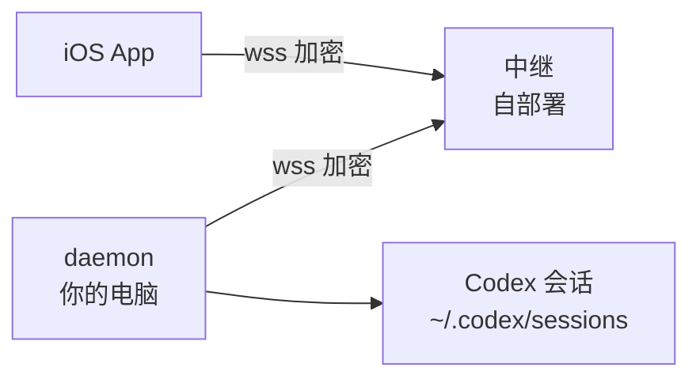

# ApiAgentControl 部署教程

> 从零到手机可用的一页式部署教程。示例中的 `relay.example.com`、`<VPS地址>`、
> `<你的密钥>` 请替换成你自己的。更细的原理与设计取舍见 [README](../README.md)。

ApiAgentControl 让 API key 方式启动的 Codex（Desktop / CLI / VSCode 插件）会话能在 iPhone 上实时查看与控制。**完全自托管**：没有官方中继、没有账号体系，会话内容全程端到端加密（X25519 + AES-256-GCM），中继和任何中间节点只能看到密文。



架构上电脑侧 daemon **主动外连**中继，你的电脑不需要开放任何公网端口。

## 前置条件

- macOS，Node ≥ 20（`node --version` 确认）
- 已安装 Codex（`codex --version` 能出版本号）
- iPhone 装好 app
- 中继二选一：本地快速方案（零成本零依赖）或 VPS 固定方案（长期用）

## 方案 A：本地快速跑通（无服务器、无域名）

中继跑在你的 Mac 上，用 Cloudflare quick tunnel 暴露公网地址：

```bash
brew install cloudflared qrencode
git clone <本仓库> && cd ApiAgentControl
scripts/start.sh
```

脚本会顺序拉起 **中继(:8090) → daemon(:8787) → 隧道**，自动生成准入密钥
（`~/.codex-watchd/relay-secret`），并在结束时打印公网 wss 地址和配对命令。
把配对命令跑一遍、生成二维码、手机扫码即完成：

```bash
node daemon/codex-watchd.js --pair --relay wss://xxx.trycloudflare.com \
  --relay-secret "$(cat ~/.codex-watchd/relay-secret)" --pair-scope control
qrencode -t ANSIUTF8 "<打印出来的 apiagentcontrol://pair?d=... 串>"
```

> [!WARNING]
> **quick tunnel 的域名每次重启都会变。**
> 配对串里嵌着中继地址，隧道重启后手机要重新配对。适合先跑通体验；
> 长期使用请升级到方案 B。

停止：`scripts/stop.sh`。日志在 `~/.codex-watchd/*.log`。

## 方案 B：VPS 固定中继（长期使用推荐）

中继是零依赖单文件，打成 Docker 容器跑在你的 VPS 上，配一个子域名 + TLS。

### 1. 部署中继容器

```bash
scp relay/server.js relay/Dockerfile <VPS地址>:~/apiagent-relay/
ssh <VPS地址> 'docker build -t apiagent-relay ~/apiagent-relay && \
  docker run -d --name apiagent-relay --restart unless-stopped \
    -p 127.0.0.1:8090:8080 -e RELAY_SECRET=<你的密钥> apiagent-relay'
```

`--restart unless-stopped` 让 VPS 重启后中继自动拉起。密钥自己生成一个：
`openssl rand -hex 24`，本地也存一份到 `~/.codex-watchd/relay-secret`（`chmod 600`）。

### 2. 反代 + TLS（必须是 wss://）

> [!CAUTION]
> **不能裸跑 ws://。**
> 配对 token 和房间号在 URL 参数里，明文过网等于把钥匙晾在路上。TLS 是硬要求。

任选其一：

**Caddy（最省事，自动签 Let's Encrypt）**——两行配置：

```
relay.example.com {
    reverse_proxy 127.0.0.1:8090
}
```

Caddy 原生支持 WebSocket 升级，DNS 里把 `relay.example.com` A 记录指到 VPS 即可。

**nginx-proxy-manager（已有 NPM 的话）**——加 Proxy Host：
域名 → `http://127.0.0.1:8090`（或容器名:8080，取决于网络拓扑），
**Websockets Support 必须打开**，SSL 签 Let's Encrypt + Force SSL。

**套 Cloudflare 橙云（可选，隐藏 VPS IP）**——证书别走 http-01（会和
"Always Use HTTPS"/Full (strict) 打架），用 **Origin CA 证书**：
Cloudflare 面板 SSL/TLS → Origin Server → Create Certificate（免费 15 年），
贴进反代的自定义证书，SSL 模式调 **Full (strict)**。
中继每 30 秒发 WebSocket ping，不会被 Cloudflare（100s）或 nginx（60s）的空闲超时掐断。

### 3. 验证

```bash
curl https://relay.example.com/health
# 期望 {"ok":true,"rooms":0,"connections":0}
```

### 4. 本地 daemon 固定化（launchd 开机自启）

```bash
echo "wss://relay.example.com" > ~/.codex-watchd/relay-url
scripts/install-launchd.sh
```

装完 daemon 由 launchd 接管：开机自启、崩溃 10 秒内自动拉起。常用命令：

```bash
launchctl kickstart -k gui/$(id -u)/com.apiagentcontrol.daemon   # 重启
scripts/install-launchd.sh --uninstall                            # 卸载
tail -f ~/.codex-watchd/daemon.log                                # 日志
```

### 5. 配对手机

```bash
node daemon/codex-watchd.js --pair \
  --relay "$(cat ~/.codex-watchd/relay-url)" \
  --relay-secret "$(cat ~/.codex-watchd/relay-secret)" \
  --pair-scope control
```

生成二维码手机扫（或把配对串发到手机上直接点开）。权限三档：
`read` 只看 / `approve` 可审批 / `control` 可发指令（**等同远程 shell**，只授予自己完全信任的设备）。中继地址固定后配对一次管到底。

## 推送通知的边界（重要）

APNs 凭证按 **Apple 开发者团队 + Bundle ID** 锁死，作者的推送密钥不随项目分发：

| 你的用法 | 查看 / 发指令 / 审批 | 推送 |
|---|---|---|
| 装作者分发的包 + 自部署后台 | ✓ 全部可用 | ✗ 不可用 |
| 从源码构建（自己的 Bundle ID + 自己的 APNs 密钥） | ✓ | ✓ |

要推送就从源码构建：需要 Apple 开发者账号（$99/年），把工程 Bundle ID 换成自己的、
在开发者后台开 Push Notifications 能力、生成 APNs 密钥（`.p8`），然后在
`~/.codex-watchd/auth.json` 加：

```jsonc
"apns": {
  "keyId": "<你的 Key ID>",
  "teamId": "<你的 Team ID>",
  "bundleId": "<你的 Bundle ID>",
  "p8Path": "~/.codex-watchd/AuthKey_XXXXXXXXXX.p8",
  "production": false   // Xcode 直装 false；TestFlight / App Store 是 true
}
```

> [!WARNING]
> **`production` 必须与安装方式匹配。**
> **TestFlight 走的是 production APNs**（反直觉但确实如此）。配错不报错、
> 无日志，推送静默失效。改完必须重启 daemon。

只装官方包不配推送的话，app 在前台一切正常，只是退后台收不到通知。

## 排查速查

| 症状 | 检查 |
|---|---|
| 手机显示电脑离线 | `tail ~/.codex-watchd/daemon.log`，daemon 是否连上中继 |
| 中继连不上 | `curl https://中继地址/health`；反代的 Websockets 开了没 |
| 401 / 密钥不对 | 本地 `relay-secret` 与中继容器的 `RELAY_SECRET` 是否一致 |
| 推送收不到 | `production` 与安装方式是否匹配；见上表 |
| 发指令报 409 | 该会话正开在 Codex Desktop 里（单写者约束），在电脑上继续或离开该会话再发 |

更多细节：[README](../README.md)（使用手册 / 中继部署 / 发版）、[relay.md](relay.md)（中继协议与踩坑）、[push.md](push.md)（推送完整说明）。
