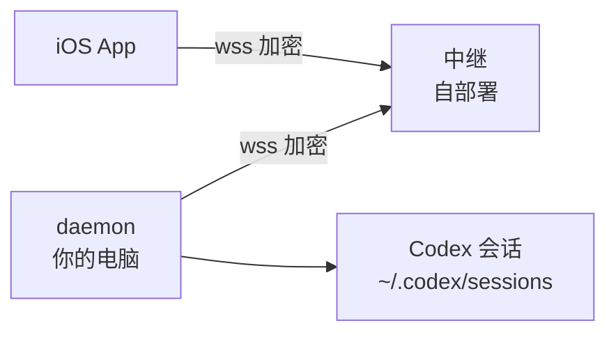

# ApiAgentControl 部署教程

> 从零到手机可用的一页式部署教程。示例中的 `relay.example.com`、`<VPS地址>`、
> `<你的密钥>` 请替换成你自己的。更细的原理与设计取舍见 [README](../README.md)。

ApiAgentControl 让 API key 方式启动的 Codex（Desktop / CLI / VSCode 插件）会话能在 iPhone 上实时查看与控制。**完全自托管**：没有官方中继、没有账号体系，会话内容全程端到端加密（X25519 + AES-256-GCM），中继和任何中间节点只能看到密文。



架构上电脑侧 daemon **主动外连**中继，你的电脑不需要开放任何公网端口。

## 你需要准备什么

| 项 | 要求 | 说明 |
|---|---|---|
| 电脑 | macOS，**长期开机不休眠** | daemon 要在你离开电脑时持续工作。合盖睡眠 = 手机端失联 |
| Node | ≥ 20（`node --version`） | 零依赖，不需要 `npm install` |
| Codex | 已安装（`codex --version`） | 控制通道靠官方 `codex app-server` 子进程 |
| iPhone | 见下节「先拿到 App」 | |
| 中继 | 方案 A（零成本）或方案 B（VPS + 域名） | 二选一 |

> [!IMPORTANT]
> **「电脑长期开着」是硬前提，不是建议。**
> 这个产品的价值是「人不在电脑前也能放行卡住的会话」——电脑一睡，既没有事件
> 也没有推送。用之前先把「防止自动进入睡眠」打开（系统设置 → 锁定屏幕），
> 笔记本还要接着电源。

## 先拿到 App

App 不在 App Store 上。两条路，**决定了推送能不能用**：

| 方式 | 查看 / 发指令 / 审批 | 推送 | 成本 |
|---|---|---|---|
| 拿作者分发的 TestFlight 包 | ✓ 全部可用 | ✗ 收不到 | 免费 |
| 自己从源码构建 | ✓ | ✓ | Apple 开发者账号 $99/年 |

原因见下面「推送通知的边界」——**不是配置问题，是签名事实**。先想清楚要哪个：
只是想在手机上看看、偶尔审批，TestFlight 包够用；想让手机在 agent 卡住时**主动叫你**，
就得自己构建。

自己构建的话，现在就可以顺手做掉，后面配 APNs 会用到自己的 Bundle ID。

## 方案 A：本地快速跑通（无服务器、无域名）

中继跑在你的 Mac 上，用 Cloudflare quick tunnel 暴露公网地址：

```bash
brew install cloudflared qrencode
git clone https://github.com/CassianFlorin/ApiAgentControl.git && cd ApiAgentControl
scripts/start.sh
```

脚本会顺序拉起 **中继(:8090) → daemon(:8787) → 隧道**，自动生成准入密钥
（`~/.codex-watchd/relay-secret`），并在结束时打印公网 wss 地址和配对命令。
把配对命令跑一遍就会直接在终端画出二维码，手机扫码即完成：

```bash
node daemon/codex-watchd.js --pair --relay wss://xxx.trycloudflare.com \
  --relay-secret "$(cat ~/.codex-watchd/relay-secret)" --pair-scope control
```

> [!WARNING]
> **quick tunnel 的域名每次重启都会变。**
> 配对串里嵌着中继地址，隧道重启后手机要重新配对。适合先跑通体验；
> 长期使用请升级到方案 B。

停止：`scripts/stop.sh`。

## 方案 B：VPS 固定中继（长期使用推荐）

中继是零依赖单文件，打成 Docker 容器跑在你的 VPS 上，配一个子域名 + TLS。

VPS 配置要求极低——中继只转发密文、不解密不落盘，**1 核 512MB 的最便宜档足够**。
前提是 VPS 上已装好 Docker，且 80/443 端口没被占用。

### 1. 部署中继容器

```bash
ssh <VPS地址> 'mkdir -p ~/apiagent-relay'
scp relay/server.js relay/Dockerfile <VPS地址>:~/apiagent-relay/
ssh <VPS地址> 'cd ~/apiagent-relay && docker build -t apiagent-relay . && \
  docker run -d --name apiagent-relay --restart unless-stopped \
    -p 127.0.0.1:8090:8080 -e RELAY_SECRET=<你的密钥> apiagent-relay'
```

`--restart unless-stopped` 让 VPS 重启后中继自动拉起。
`-p 127.0.0.1:8090` 只监听本机回环——中继**不直接对公网开放**，由反代接管 TLS。

密钥自己生成一个：`openssl rand -hex 24`，本地也存一份：

```bash
echo "<你的密钥>" > ~/.codex-watchd/relay-secret && chmod 600 ~/.codex-watchd/relay-secret
```

### 2. 反代 + TLS（必须是 wss://）

> [!CAUTION]
> **不能裸跑 ws://。**
> 配对 token 和房间号在 URL 参数里，明文过网等于把钥匙晾在路上。TLS 是硬要求。

任选其一：

**Caddy（最省事，自动签 Let's Encrypt）**——两行配置：

```
relay.example.com {
    reverse_proxy 127.0.0.1:8090
}
```

Caddy 原生支持 WebSocket 升级，DNS 里把 `relay.example.com` A 记录指到 VPS 即可。

**nginx-proxy-manager（已有 NPM 的话）**——加 Proxy Host：
域名 → `http://127.0.0.1:8090`（或容器名:8080，取决于网络拓扑），
**Websockets Support 必须打开**，SSL 签 Let's Encrypt + Force SSL。

**套 Cloudflare 橙云（可选，隐藏 VPS IP）**——证书别走 http-01（会和
"Always Use HTTPS"/Full (strict) 打架），用 **Origin CA 证书**：
Cloudflare 面板 SSL/TLS → Origin Server → Create Certificate（免费 15 年），
贴进反代的自定义证书，SSL 模式调 **Full (strict)**。
中继每 30 秒发 WebSocket ping，不会被 Cloudflare（100s）或 nginx（60s）的空闲超时掐断。

### 3. 验证中继

```bash
curl https://relay.example.com/health
# 期望 {"ok":true,"rooms":0,"connections":0}
```

这一步不通就别往下走——后面每一步都依赖它。

### 4. 本地 daemon 固定化（launchd 开机自启）

```bash
echo "wss://relay.example.com" > ~/.codex-watchd/relay-url
scripts/install-launchd.sh
```

装完 daemon 由 launchd 接管：开机自启、崩溃 10 秒内自动拉起。常用命令：

```bash
launchctl kickstart -k gui/$(id -u)/com.apiagentcontrol.daemon   # 重启
scripts/install-launchd.sh --uninstall                            # 卸载
tail -f ~/.codex-watchd/daemon.log                                # 日志
```

### 5. 配对手机

```bash
node daemon/codex-watchd.js --pair \
  --relay "$(cat ~/.codex-watchd/relay-url)" \
  --relay-secret "$(cat ~/.codex-watchd/relay-secret)" \
  --pair-scope control
```

装了 `qrencode` 会直接在终端画出二维码，手机扫即可（或把打印出来的
`apiagentcontrol://pair?d=...` 整行发到手机上直接点开）。权限三档：
`read` 只看 / `approve` 可审批 / `control` 可发指令（**等同远程 shell**，只授予自己完全信任的设备）。中继地址固定后配对一次管到底。

## 验收：确认整条链路通了

配对完成后，在电脑上跑一遍：

```bash
TOKEN=$(node -e 'console.log(JSON.parse(require("fs").readFileSync(process.env.HOME+"/.codex-watchd/auth.json")).devices.find(d=>d.id==="local").token)')
curl -s "http://127.0.0.1:8787/status?token=$TOKEN"
```

四个关键字段，任一为假就对照右列排查：

| 字段 | 期望 | 为假说明 |
|---|---|---|
| `relay.connected` | `true` | daemon 没连上中继：查中继地址、准入密钥、反代的 WebSocket 开关 |
| `control.appServerUp` | `true` | 找不到 `codex` 可执行文件：**只读监听正常，但发不了指令**（launchd 的 PATH 问题居多） |
| `watch.sessions` | > 0 | 没扫到会话：`~/.codex/sessions` 下是否真有 `rollout-*.jsonl` |
| `push.configured` | `true` | 没配 APNs，见下节。不影响其他功能 |

再在手机上确认：会话列表能出来、点进任一会话能看到历史、设置页「权限」显示的档位与配对时一致。

## 推送通知的边界（重要）

APNs 凭证按 **Apple 开发者团队 + Bundle ID** 锁死，作者的推送密钥不随项目分发。

这条边界不是配置问题，是签名事实：APNs 是 Apple 的服务器，不存在"换成自己的推送
服务器"这个选项。能配的只是**谁有权发**，而这个授权只发给拥有该 Bundle ID 的团队。
你手里若是作者签名的包，设备 token 就属于作者的 Bundle ID，你自己的 `.p8` 推过去
只会被 APNs 拒掉（`TopicDisallowed`）。

要推送就从源码构建。需要 Apple 开发者账号（$99/年），改两处设置即可：

在 Xcode 里打开 `ios/ApiAgentControl.xcodeproj`，选中 target → Signing & Capabilities，
把 **Team** 换成你自己的、**Bundle Identifier** 换成你自己的（如
`com.yourname.apiagentcontrol`）。Debug 和 Release 两个配置都要改 —— 对应
`project.pbxproj` 里的 `DEVELOPMENT_TEAM` 和 `PRODUCT_BUNDLE_IDENTIFIER` 各两处。
签名是 Automatic，改完 Xcode 会自动申请描述文件。

`aps-environment` 的两份 entitlements **不用动**，工程已按 Debug/Release 拆好了。

然后在开发者后台开 Push Notifications 能力、生成 APNs 密钥（`.p8`），把 `.p8`
放进 `~/.codex-watchd/`（`chmod 600`），在 `~/.codex-watchd/auth.json` 加：

```jsonc
"apns": {
  "keyId": "<你的 Key ID>",
  "teamId": "<你的 Team ID>",
  "bundleId": "<你的 Bundle ID>",
  "p8Path": "~/.codex-watchd/AuthKey_XXXXXXXXXX.p8",
  "production": false   // Xcode 直装 false；TestFlight / App Store 是 true
}
```

> [!WARNING]
> **`production` 必须与安装方式匹配。**
> **TestFlight 走的是 production APNs**（反直觉但确实如此）。配错不报错、
> 无日志，推送静默失效。改完必须重启 daemon。

只装作者分发的包、不自建推送的话，app 在前台一切正常，只是退后台收不到通知。
这种情况 app 里看得见：设置页 →「通知」会显示「电脑端未配置推送」，不会让你
以为是通知坏了。

配完之后确认走通了：

```bash
curl -s "http://127.0.0.1:8787/me?token=<你的设备 token>"
# 期望 "push": {"configured": true, "tokenRegistered": true}
```

`configured` 为假是 daemon 没读到 apns 段；`tokenRegistered` 为假是手机的 token
还没报上来（连上后几秒内自动补交，长期不变就在手机上重连一次）。

## 日常运维

**升级**——拉代码后必须重启 daemon，否则跑的还是旧进程：

```bash
git pull
launchctl kickstart -k gui/$(id -u)/com.apiagentcontrol.daemon
```

中继侧同理：重新 `scp` + `docker build` + `docker rm -f apiagent-relay` 再 run。

**管理设备**——手机丢了、或想收回某台设备的权限：

```bash
node daemon/codex-watchd.js --list-devices              # 看都有谁
node daemon/codex-watchd.js --revoke-device <设备 id>   # 立即失效，无需重启
```

**换中继地址**：改 `~/.codex-watchd/relay-url` 后 `kickstart` 即可，密钥和设备都不用重配。
但**手机需要重新配对**——地址嵌在配对串里。

**日志**在 `~/.codex-watchd/*.log`，daemon 自己轮转（单文件超 2MB 原地截断，
留末尾 256KB），不用另配 logrotate。后台运行时只记审批和错误，**会话正文不落盘**
（要全量加 `--verbose`）。

**菜单栏开关**（可选）——`macos/build.sh --install` 装一个菜单栏小 App，
能看 daemon 状态、一键起停、打开调试页，不用记 `launchctl` 命令。

## 安全边界

搭之前先明白每层防的是什么：

- **`relay-secret`** 只是中继的**准入门槛**，防止陌生人白嫖你的中继占资源。
  它**不参与加密**——就算泄露，别人也解不开你的会话内容。
- **会话内容**由 daemon 与手机端协商的 X25519 密钥端到端加密。
  中继、反代、Cloudflare 全都只看得到密文。
- **配对串是完整凭证**（含 token + 中继地址 + 准入密钥）。
  转发给别人 = 把你电脑的访问权给出去。**一次性使用，别截图发群里。**
- **`control` 档位等同远程 shell**。给自己的手机可以，给别人要想清楚。
  不确定就先发 `read`，随时可以再配一个高档位的。
- **`~/.codex-watchd/`** 里有 token 和 APNs 私钥，权限应为 `600`。
  daemon 会自己按 `700` 建目录，别手动放宽。
- **daemon 默认只监听 `127.0.0.1`**。非回环地址 + `--no-auth` 的组合会被
  拒绝启动——那等于把一个能执行任意命令的接口裸奔到网络上。

## 排查速查

| 症状 | 检查 |
|---|---|
| 手机显示电脑离线 | `tail ~/.codex-watchd/daemon.log`，daemon 是否连上中继 |
| 中继连不上 | `curl https://中继地址/health`；反代的 Websockets 开了没 |
| 401 / 密钥不对 | 本地 `relay-secret` 与中继容器的 `RELAY_SECRET` 是否一致 |
| 能看不能发 | `/status` 的 `control.appServerUp`——多半是 launchd 的 PATH 里没有 `codex` |
| 会话列表是空的 | `~/.codex/sessions` 下有没有 `rollout-*.jsonl`；daemon 从 EOF 开始跟，**跑起来之后**的新活动才可见 |
| 推送收不到 | `production` 与安装方式是否匹配；设置页有没有提示「电脑端未配置推送」 |
| 发指令报 409 | 该会话正开在 Codex Desktop 里（单写者约束）。列表里会标锁图标，**退出 Desktop 才释放**，仅在界面里离开会话没用 |
| 隧道重启后连不上 | 方案 A 的域名变了，重新配对；长期用请上方案 B |

更多细节：[README](../README.md)（使用手册 / 中继部署 / 发版）、[relay.md](relay.md)（中继协议与踩坑）、[push.md](push.md)（推送完整说明）。
